# Procesverslag
**Auteur:** -Lalla Bah-

**Het werk:** [opdracht 1](opdracht1/index.html) en [opdracht 2](opdracht2/index.html)

Markdown cheat cheet: [Hulp bij het schrijven van Markdown](https://github.com/adam-p/markdown-here/wiki/Markdown-Cheatsheet). Nb. de standaardstructuur en de spartaanse opmaak zijn helemaal prima. Het gaat om de inhoud van je procesverslag. Besteedt de tijd voor pracht en praal aan je website.

## Bronnenlijst
1. https://www.w3schools.com/howto/howto_css_custom_checkbox.asp
2. https://www.youtube.com/watch?v=fYq5PXgSsbE
3. https://www.w3schools.com/howto/howto_js_display_checkbox_text.asp
4. http://jsfiddle.net/binaryben/aLx3m4k5/
5. https://www.w3schools.com/tags/tryit.asp?filename=tryhtml5_input_type_radio
6. https://www.w3schools.com/tags/att_input_type_radio.asp
7. https://www.fontsquirrel.com/
8. https://stackoverflow.com/questions/38930144/keep-input-value-after-refresh-page
9. https://www.a11yproject.com/posts/2013-01-11-how-to-hide-content/
10. https://www.computerhope.com/issues/ch001475.htm#top
11. https://stackoverflow.com/questions/44505877/show-and-hide-depend-on-screen-size
12. Hulp van studentassistent Sam Slotemaker
13. https://youtu.be/rVcphsUupws 

## Week 1

Afgelopen week ben ik aan de slag gegaan met de oefeningen. Dit ging goed bij de eerste animaties en de custom properties. Daarna was het voor mij best lastig om de sommetjes te maken. Meestal lukte de eerste vier wel en daarna ging het bergafwaarts. 

Ik heb alvast nagedacht over de logo's die ik wil animeren en zal daar dieper op in gaan in week 2. 

## Week 2
Ik ben aan de slag gegaan met de opdrachten en heb gekeken naar de mogelijkheden. Aan de hand daarvan heb ik besloten om twee compleet verschillende logo's te animeren op zo'n manier dat het goed pas bij de doelgroep. Nickelodeon wordt speels geanimeerd en Gucci chique.

Wat goed ging was het bedenken en ontwerpen van de stijlen waarin ik de logo's wil animeren. Hier haalde ik namelijk erg veel plezier uit. Ook heb ik het font goed geinstalleerd en werkt het responsive. Helaas ging het animeren niet heel goed. 

Ik ben begonnen met het eerste logo: Nickelodeon. Het lukt me om de letters vanuit het niets naar het midden te animeren. En daar houdt het helaas op. Het animeren per letter lukt mij niet ookal heb ik dit op verschillende manieren geprobeerd. Ik hoop dat ik tijdens het voortgangsgesprek te horen krijg wat ik verkeerd heb gedaan. 

Mijn plan is, als dat probleem verholpen is, om de letters per letter naar het midden te animeren. 

### Nickelodeon Logo
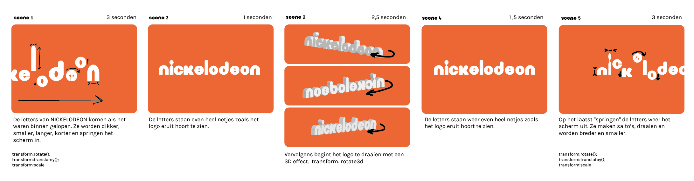

### Gucci Logo
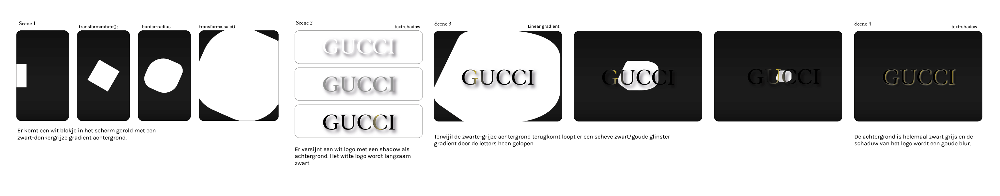

### Eerste voortgangsgesprek
- Hoe kan ik meerdere dingen animeren?
- Waarom lukt het mij niet om per letter (span) te animeren?

scalex en scaley om langer te maken

0 en 10% en 10 - 90 helemaal niks en daarna weg
en de animatie duurt 10s

## Week 3

Deze week is het, met behulp van de tips tijdens het voortgangsgesprek, mij gelukt om alle letters van Nickelodeon op zijn eigen manier te laten bewegen. Dit ziet er erg speels en grappig uit. Waar ik nu nog moeite mee heb is om ze dan weer gezamelijk te laten bewegen. Helaas kan ik deze week niet bij het voortgangsgesprek zijn. Wel kan ik in het kanaal en aan klasgenoten vragen hoe dit nog kan.

Ik merk dat ik het moeilijk vind om door te gaan naar de volgende stap als de eerste nog niet helemaal af is. Dat komt omdat ik te lang blijf hangen in kleine stapjes. Als het te lang niet lukt vind ik het lastig om nog motivatie te vinden. Gelukkig heb ik ook veel gehad aan google en youtube.

## Meivakantie

## Week 5

Ik heb me in de meivakantie voorbereid op de eindpresentatie. Ik was erg lang bezig met het nickelodeon logo en ben eignelijk te laat begonnen met het gucci logo. Daarom heb ik me bij GUCCI niet helemaal aan het script gehouden wat ik bedacht. Wel vind ik dat beide animaties goed passen bij het merk.

Hoewel er een aantal dingen zijn die ik liever anders had gedaan, ben ik tevreden met mijn werk. Hij werkt voor dark en light mode en heeft een vloeiende overgang. Eerst was dit niet zo. Je zag eerst precies waar welk percentage zat en de animatie verliep nogal houterig. Dat is nu vrijwel verholpen.

Al met al zijn de afgelopen weken erg leerzaam geweest en ben ik weer een stapje verder met frontend voor designers. Het is niet geheel vlekkeloos gegaan maar ik vind het fijn om vooruitgang te zien. 

Wat ik anders had willen doen maar geen tijd voor heb gehad:
- vw gebruiken ipv em bij de afstand links van nickelodeon, zodat het beter responsive werkt
- nog een vorm toevoegen aan het Gucci logo
- dark en light mode laten werken via een toggle button

## Presentatie

De presentatie verliep goed, ik koos er voor om als eerste te gaan zodat ik tips kon krijgen en daarna goed kon focussen op de anderen. Ik heb een aantal tips gehad die erg handig zijn om toe te passen op mijn code:

1. Als je de opacity op 0 zet kan het logo niet gelezen worden door screenreaders en als het klikbaar is, kunnen mensen er per ongeluk op klikken. Ipv opacity:0; kan ik beter color:transparent; gebruiken of scale:0;.
2. Het is goed dat ik nth-of-type(2) heb gebruikt, maar het zou handig zijn als ik met commentaar erbij zou zetten over welke letter het gaat zodat ik niet in de war raak.
3. Bij GUCCI is het eignelijk onnodig dat ik per letter een eigen animatie heb gemaakt waarbij de percentages later scalen. In plaats daarvan had ik gewoon een animation-delay:1s; kunnen gebruiken. 

## Opdracht 2

Bij deze opdracht vond ik de oefeningen van te voren al erg lastig. Daarom had ik een stuk minder motivatie. Ik wist steeds niet waar ik moest beginnen en stelde daarom mijn werk uit. 

Uiteindelijk heb ik ervoor gekozen om de films te kiezen die je kunt filteren. Ik bedacht dat het er zo uit zou moeten zien:

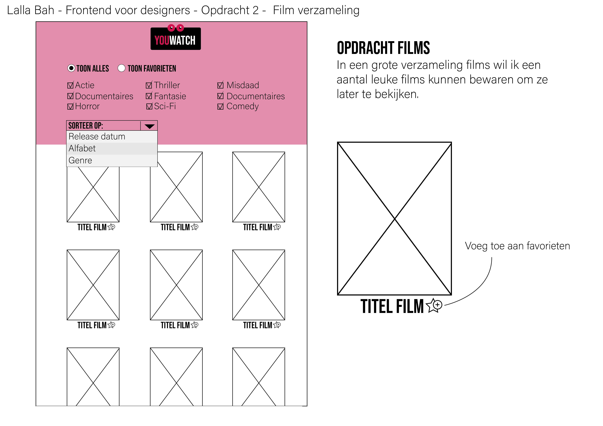

Ik was hier wat later mee en kreeg als feedback dat het meer microinteracties kon bevatten en wat uitgebreider mocht. Tijdens het werken aan deze opdracht heb ik daarom wat dingen bedacht die het interessanter zouden maken.

## Vragen
- Hoe zorg je dat je content onder de fixed header valt
- Hoe kan het dat ik alleen de eerste film selecteer en waarom werkt queryselectorall niet?
- Is er een betere manier om dei sterretjes rechts boven te plaatsen
- Hoe kan ik iets toevoegen aan favorieten?

Het begin was het aller moeilijkst. Met html en css kan ik meestal wel uitvinden hoe het werkt. Javascript voelt voor mij een stuk minder natuurlijk en hierbij heb ik altijd een voorbeeld nodig. Gelukkig kon ik terugkijken naar de opdrachten van de les. 

De eerste stappen heb ik tijdens de feedbackmomenten ondervonden en voor de rest ben ik zelf aan de slag gegaan met dingen die ik al wist en het combineren van de informatie die ik heb gekregen.

Het naam geven vind ik erg leuk om de gebruiker persoonlijk welkom te heten. Hierdoor wordt het persoonlijker en voor de gebruiker interessanter om te gebruiken. 

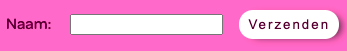

Wat ik ook erg leuk vind, is dat het na verschillende methodes uit te zoeken toch is gelukt om de favorieten te onderscheiden van "alles" in de lijst. Hierdoor kan de gebruiker filteren door zijn favoriete films.

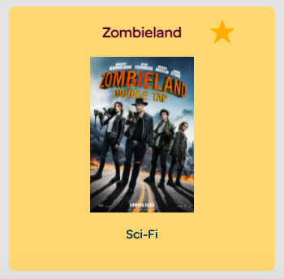

Al met al denk ik dat ik een stap in de goede richting heb gezet, maar weet ik ook dat ik frontend altijd onderschat qua tijd en aandacht. Voor kleine veranderingen heb ik ontzettend veel tijd nodig. Ik vind het lastig maar kan er wel erg van genieten als het eindelijk lukt zoals ik het wil.

Ik vind het erg leuk dat de dark/light modus werkt en dat ik een persoon kan welkomheten als diegene zijn/haar naam invoert. Ook heb ik het responsive gemaakt en dat is iets wat erg belangrijk is, maar ik hiervoor nog erg lastig vond. Ik heb gemerkt dat ik iets goed kan leren door naar ander mans werk te kijken en het zelf naar mijn eigen wens aan te passen. 

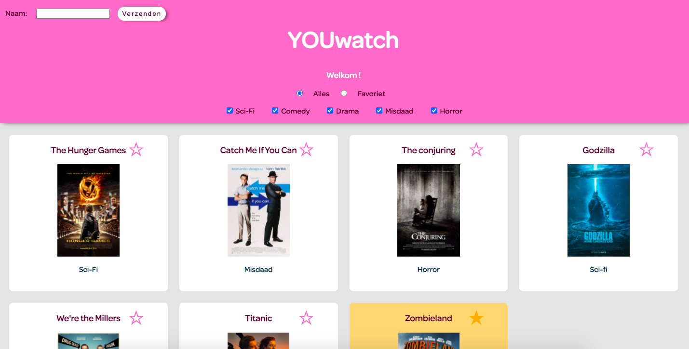
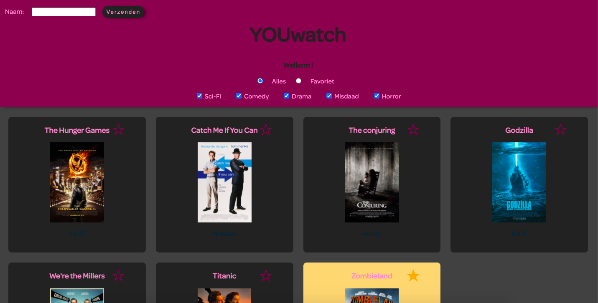

## Herkansing

Ik was bij het eindgesprek te laat met het inleveren. Dit wist ik van te voren, omdat ik de tijd die ik eraan zou besteden nog al had onderschat. Gelukkig mag ik nog gebruik maken van de herkansing en kon ik dit gesprek gebruiken als extra feedbackmoment. De dingen die ik nog wil aanpassen zijn:

1. Toegankelijkheid met het toetsenbord (.visually hidden sterren)
2. Naam toevoegen aan favorieten
3. Random movie generator
4. Naam blijft staan in aanmeldbalk
5. meer films zonder meer code toe te voegen
6. Responsive (mobiel)
7. Animatie (movie generator)
8. dark mode verbeteren

De studentassistent Sam, gaf aan dat ik in plaats van javascript code per film te gebruiken, ik ook met veel kortere code alle films kon favorieten. Dit is erg gunstig geweest. 

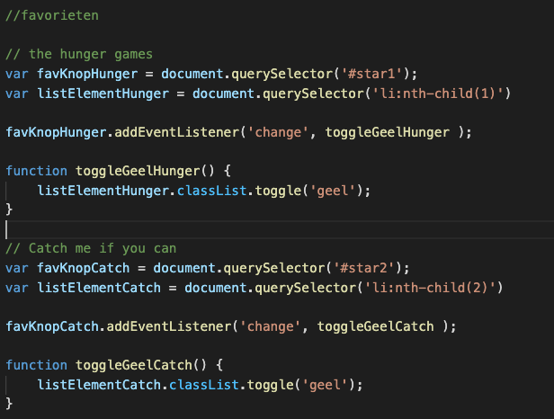

Ik kon ook door middel van deze code het double tap idee toepassen. 
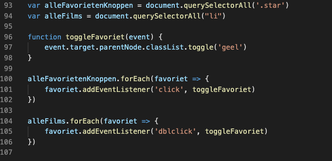

Dit heb ik uiteindelijk toch weg gelaten omdat het mij niet lukte om ook de checkboxes te veranderen van kleur. Dit is jammer, maar het is niet logisch als de ster dan niet gecheckt wordt. 

## Random movie generator

Wat mij leuk leek is om een random movie generator te creeren voor de gebruiker. De gebruiker kan op een button klikken en er wordt een random film uit de lijst gegenereerd. 

Ik bedacht me ook dat het wat lastig is voor de gebruiker om te weten dat je dubbel moet klikken om een random film te genereren. Daarom heb ik ervoor gekozen om een animatie te gebruiken als je over de knop "hovert". Hij krijgt een soort hartslag effect, wat vergelijkbaar is met dubbel klikken. Hierdoor zal de gebruiker eerder weten dat hij/zij moet klikken. 

## Eindreflectie

Na de verbteringen ben ik over het algemeen best blij met mijn werk. Ik besef me wel dat het beter had gekund, maar voor mijn skills heb ik het gevoel dat ik enorm vooruit ben gegaan met het coderen. Ik kan nu namelijk een responsive website creeren, met verschillende events, animaties, dark mode en microinteracties. 

Ook heb ik ervoor kunnen zorgen dat alles met het toetsenbord te bedienen is. Hier had ik eerst namelijk moeite mee, maar ik ben tevreden omdat het nu wel is gelukt. 

Wat ik lastig vond is eigenlijk het beschrijven van bepaalde code en wat het preceis doet. Als ik ergens niet uit kwam wist ik niet goed welke termen ik kon gebruiken om het probleem te googelen bijvoorbeeld. Gelukkig haalde ik ook veel informatie uit de lessen en oefeningen.

Het is me voor de herkansing gelukt om de volgende dingen aan te passen:

1. Toegankelijkheid met het toetsenbord (.visually hidden sterren)
2. Naam toevoegen aan favorieten
3. Random movie generator
4. Naam blijft staan in aanmeldbalk
5. meer films zonder meer code toe te voegen
6. Responsive (mobiel)
7. Animatie (movie generator)
8. dark mode verbeteren

Uiteindelijk ontwerp lightmode:

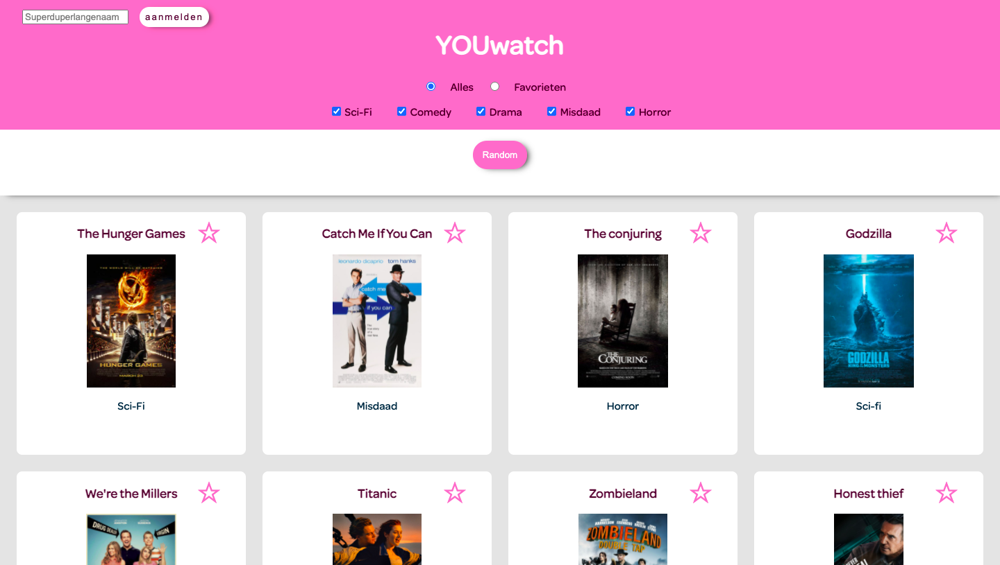
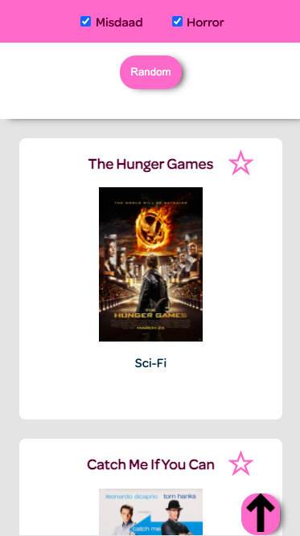

Uiteindelijk ontwerp darkomde:

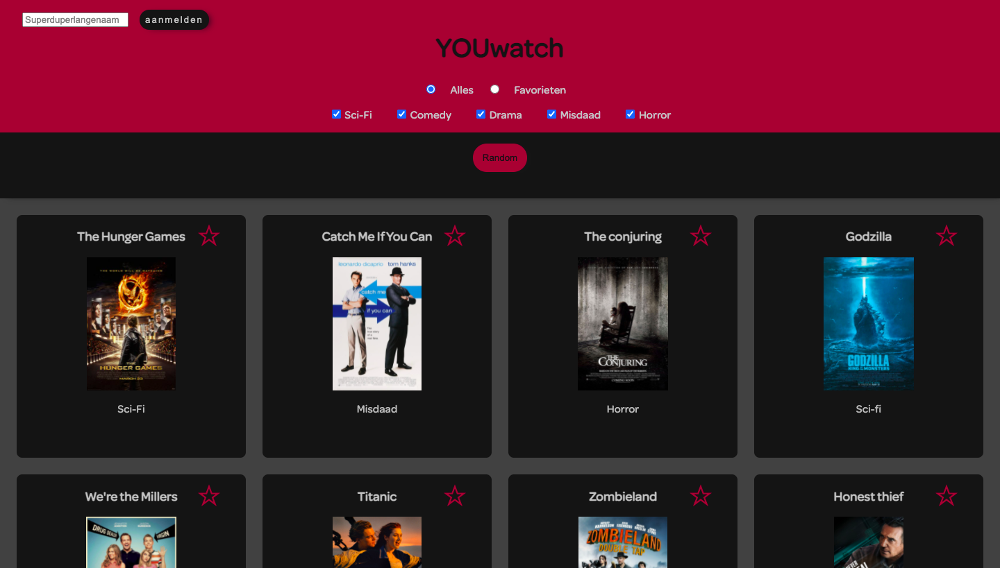
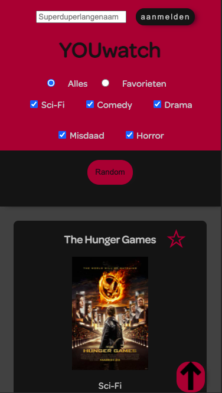
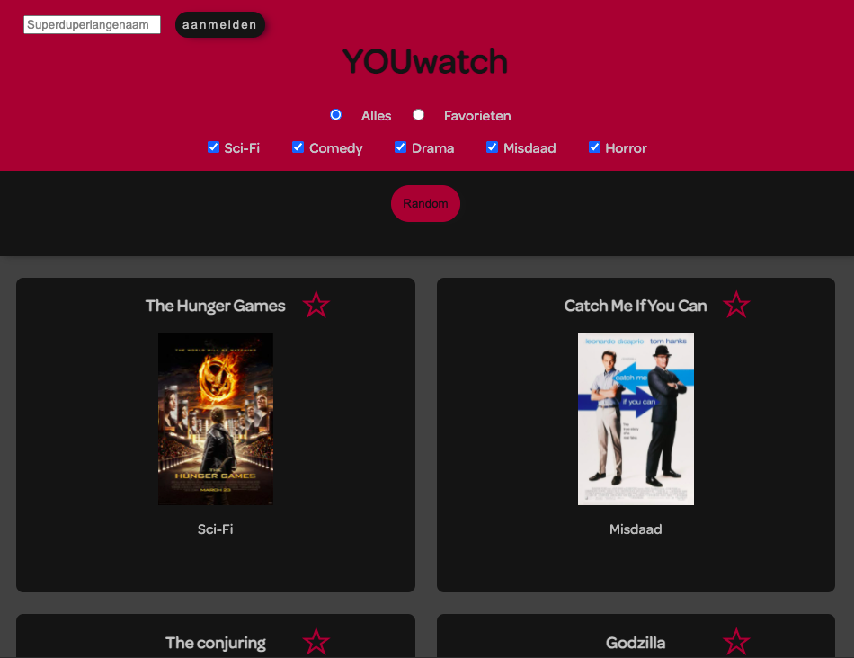